# LR6
Лабораторная работа №6
# Лабораторная работа №6
## Система контроля версий

### Выполнил: Кударов Д. М. группа 4414

### Цель работы:
Изучение базовых возможностей системы управления версиями, опыт работы с Git Api, опыт работы с локальным и удаленным репозиторием.

### Ход работы:

#### 1-5. Подготовительные этапы
- Создан аккаунт на GitHub: 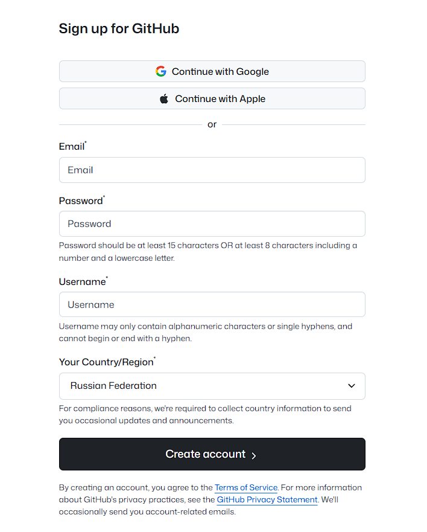
- Выполнен форк репозитория
- Установлен и настроен Git
- Репозиторий клонирован на локальную машину: 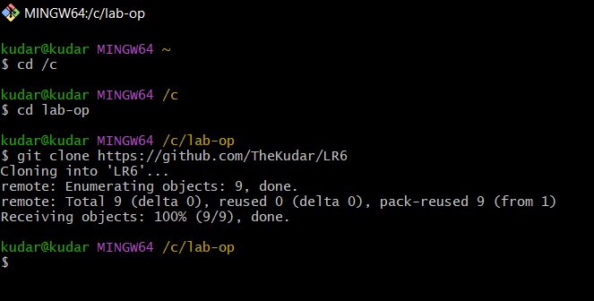

#### 6. Добавление файла через интерфейс GitHub
- Добавлен файл через веб-интерфейс GitHub: 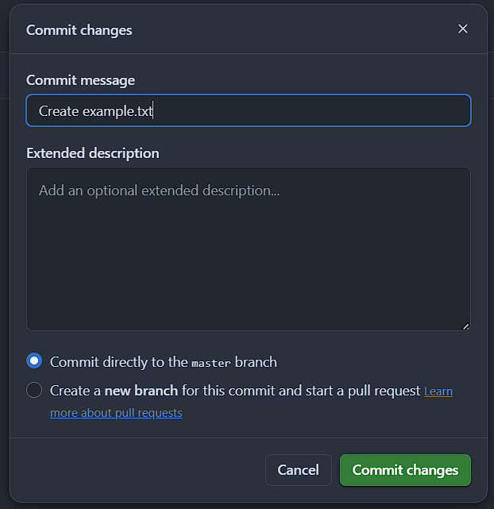

- Для того, чтобы подтянуть изменения в локальный репозиторий используется команда `git pull`: 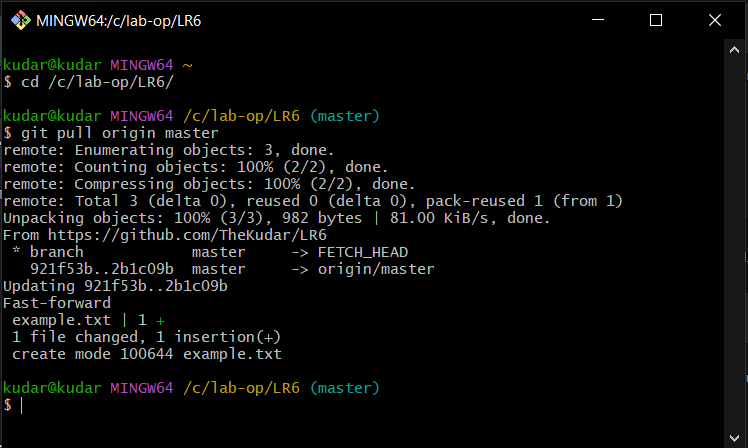

#### 7. История операций для каждой из веток
Получение истории операций выполняется c помощью команды `git log --all`: 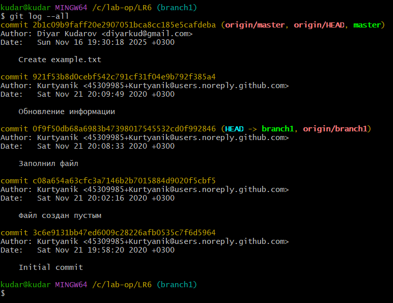

#### 8. Просмотр последних изменений
Для просмотра последних изменения можно воспользоваться командой `git diff`: 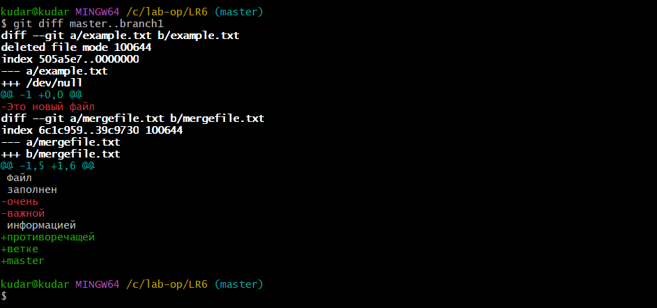

#### 9. Выполнение слияния в ветку master
Для слияния в ветку master необходимо находится в ней, а затем выполнить команду `git merge`: 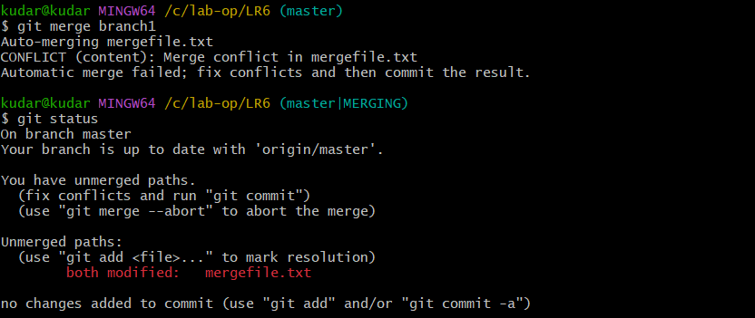

#### 10. Удаление побочной ветки
`git brach -d` с указанием названия ветки удаляет ее: 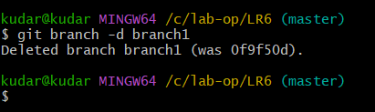

#### 11. Создание изменений и их фиксирование
Создание файлов осуществляется с помощью команды `echo`: 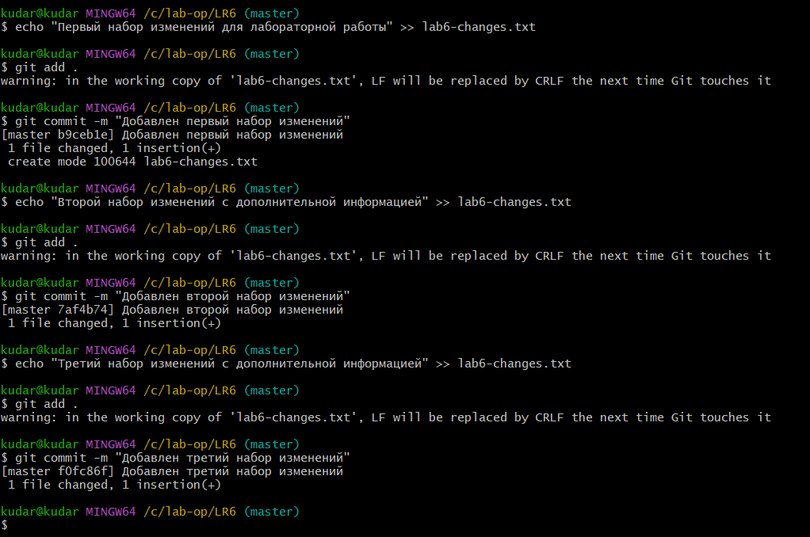

#### 12. Выполнение отката коммита
`git reset` с опцией `--hard` и ссылкой на коммит `~HEAD` позволяет удалить последний коммит: 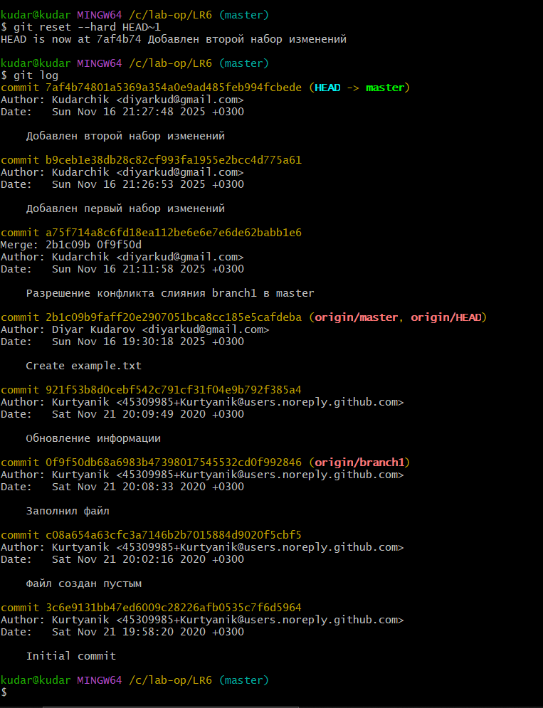

#### 13. Создание ветки для отчета:
Команда `git checkout -b report` создает новую ветку report и сразу же выполняет переход в нее: 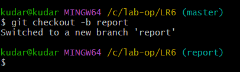

#### 14. 